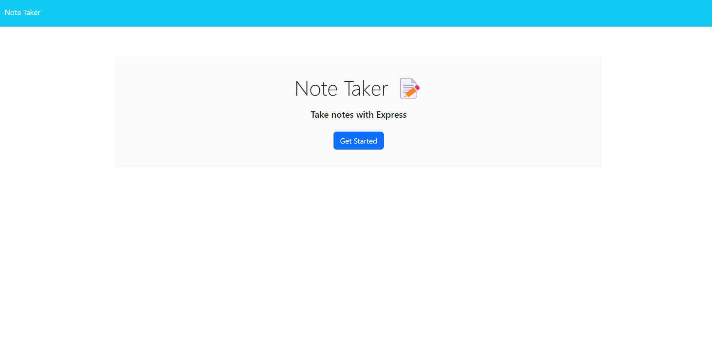

# note-taker

I made a server.js file to make and complete my routes.
I used the app.get to collect the information and to send the information.
app.post was used to make unique ID's for each note.
The app.delete mixed with the fs was used to complete the delete function.

github:https://github.com/ZekeTinch/note-taker
website:https://note-taker-ga15.onrender.com/